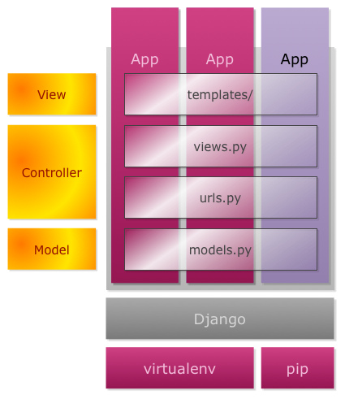
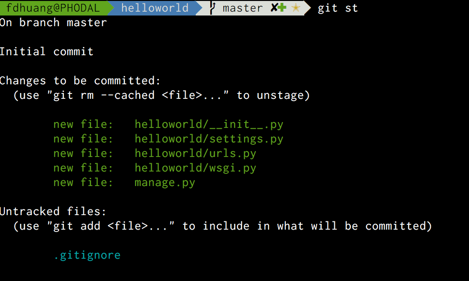
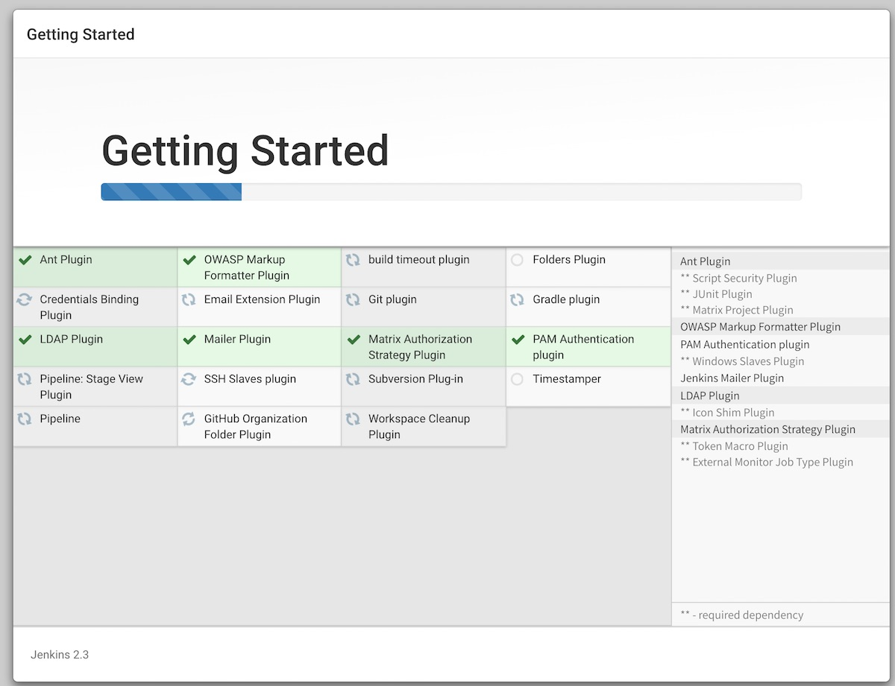
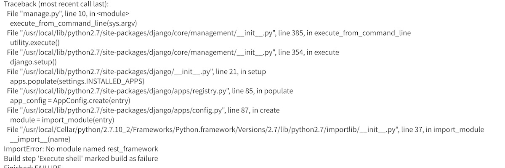
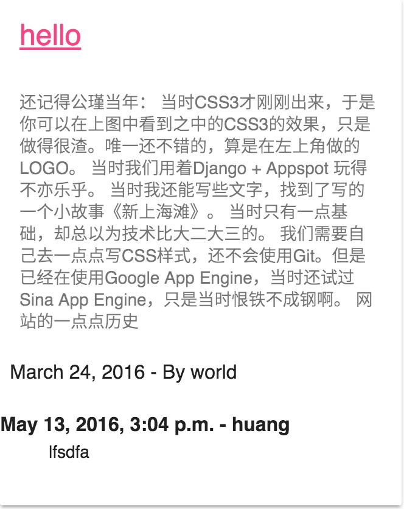

Growth In Action Django
===

准备工作和工具
---

在开始写代码之前你需要保证你有一些Python基础，如果没有的话，请参阅其他相关书籍来一起学习。

并且你还需要在你的计算机上安装：

 - Python环境及其包管理工具pip。
 - Firefox浏览器——用于运行功能测试。
 - Git版本控制器——用于代码版本控制。
 - 一个开发工具。（PS: 在这里笔者使用的是PyCharm的社区版）
 

深入浅出Django
===

Django简介
---

Django是一个高级的Python Web开发框架，它的目标是使得开发复杂的、数据库驱动的网站变得更加简单。

由于Django最初是被开发来用于管理劳伦斯出版集团旗下的一些以新闻内容为主的网站的。所以，我们可以发现在使用Django的很多网站里，都是用于作为CMS（内容管理系统）来使用的。使用Django的一些比较知名的网站如下图所示：


Django是一个MTV框架，其架构模板看上去与传统的MVC架构并没有太大的区别。其对比如下表所示：

传统的MVC架构| Django 架构
-----------|-----------
Model      | Model(Data Access Logic)
View       |Template(Presentation Logic)
View       | View(Business Logic)
Controller | Django itself

在Django中View只用来描述你要看到的内容，Template才是最后用于显示的内容。而在MVC架构中，这只相当于是View层。它的核心包含下面的四部分：

 - 一个 对象关系映射，作为数据模型和关系性数据库间的媒介（Model层）；
 - 一个基于正则表达式的URL分发器（即MVC中的Controller)；
 - 一个用于处理HTTP请求的系统，含web模板系统(View层)；

其核心框架还包含：

 - 一个轻量级的、独立的Web服务器，只用于开发和测试。
 - 一个表单序列化及验证系统，用于将HTML表单转换成适用于数据库存储的数据。
 - 一个缓存框架，并且可以从几种缓存方式中选择。
 - 中间件支持，能对请求处理的各个阶段进行处理。
 - 内置的分发系统允许应用程序中的组件采用预定义的信号进行相互间的通信。
 - 一个序列化系统，能够生成或读取采用XML或JSON表示的Django模型实例。
 - 一个用于扩展模板引擎的能力的系统。

### Django应用架构

Django的每一个模块在内部都称之为APP，在每个APP里都有自己的三层结构。如下图所示：



这样做不仅可以在开发的时候更容易理解系统，而且可以提高代码的可复用性——因为每一个APP都是独立的应用，在下次使用时我们只需要简单的复制和粘贴。

说了这么多，还不如从一个hello,world开始。

Django hello,world
---

###安装Django

安装Django之前，我们可以用virtualenv工具来创建一个虚拟的Python运行环境。环境问题是一个很复杂的问题，在我们使用Python的过程中，我们会不断地安装一些库，而这些库可能会有不同的版本。并且在安装Python库的过程中，我们会遇到权限问题——即我们需要超级用户的权限才能将库安装到系统的环境之下。随后在这个软件的生涯中，我们还需要保证这个项目所依赖的模块不会发生变动。而这些都是很棘手的一些事，这时候我们就需要创建一个虚拟的运行环境，而virtualenv就是这样的一个工具。

####virtualenv

安装Python包我们需要用到pip命令，它是Python语言中的一个包管理工具。如果你没有安装的话，可以使用下面的命令来安装：

```
curl https://bootstrap.pypa.io/get-pip.py | python
```

在不同的Python环境中，我们可能需要使用不同的pip，如下所示是笔者使用的Python3的pip命令pip3

```
$ pip3 install virtualenv
```

如果是Python2.7的话，对应会有:

```
$ pip install virtualenv
```

需要注意的是这将会安装到Python所在的目录，如我的目录是:

```
$ /usr/local/bin/virtualenv
```

有的可能会是：

```
$ /usr/local/share/python3/virtualenv
```

在创建我们的这个虚拟环境之前，我们可以创建一个存储所有virtualenv的目录：

```
$ mkdir somewhere/virtualenvs
```

现在，我们就可以创建一个新的虚拟环境：

```
$ virtualenv somewhere/virtualenvs/<project-name> --no-site-packages
```

如果你想使用不同的Python版本的话，那么需要指定Python版本的路径

```
$ virtualenv --distribute -p /usr/local/bin/python3.3 somewhere/virtualenvs/<project-name>
```

通过到相应的目录下执行激活就可以使用这个虚拟环境了：

```
$ cd somewhere/virtualenvs/<project-name>/bin
$ source activate
```

停止使用只使用执行下面的命令即可：

```
$ deactivate
```

####安装Django

准备了这么久我们终于安装Django了，执行：

```
$ pip install django
```

那么我们并会开始下最新版本的Django，如下所示：

```
Collecting django
  Downloading Django-1.9.4-py2.py3-none-any.whl (6.6MB)
    94% |██████████████████████████████▎ | 6.2MB 251kB/s eta 0:00:02
```    

等下载完后，就会开始安装Django。安装这完后，我们就可以使用Django自带的django-admin命令。django-admin是Django自带的一个管理任务的命令行工具。

通过这个命令，我们不仅仅可以用它来创建项目、创建app、运行服务、数据库迁移，还可以执行各种SQL工具等等。django-admin用法如下：

```
$ django-admin <command> [options]
```

下面是django-admin自带的一些命令：

```
[django]
    check
    compilemessages
    createcachetable
    dbshell
    diffsettings
    dumpdata
    flush
    inspectdb
    loaddata
    makemessages
    makemigrations
    migrate
    runfcgi
    runserver
    shell
    sql
    sqlall
    sqlclear
    sqlcustom
    sqldropindexes
    sqlflush
    sqlindexes
    sqlinitialdata
    sqlmigrate
    sqlsequencereset
    squashmigrations
    startapp
    startproject
    syncdb
    test
    testserver
    validate
```

现在，让我们来看看这个强大的工具。

###创建项目

在这些命令中startproject可以用于创建项目，在这里我们的项目名是blog，那么我们的命令如下：

$ django-admin startproject blog

这个命令将创建下面的文件内容，而这些是Django项目的一些必须文件。

```
.
├── blog
│   ├── __init__.py
│   ├── settings.py
│   ├── urls.py
│   └── wsgi.py
└── manage.py
```

blog目录对应的就是blog这个项目，将会放置这个项目的一些相关配置：

1. settings.py包含了这个项目的相关配置。如数据库环境、启用的插件等等。
2. urls.py即URL Dispatcher的配置，指明了某个URL应该指向某个函数来处理。
3. wsgi.py用于部署。WSGI（Python Web Server Gateway Interface，Web服务器网关接口）是为Python语言定义的Web服务器和Web应用程序或框架之间的一种简单而通用的接口。
4. __init__.py指明了这是一个Python模块。

manage.py 会在每个Django项目中自动生成，它可以和django-admin做类似的事。如我们可以用manage.py来启动测试环境的服务器：

$ python manage.py runserver

```
Performing system checks...

System check identified no issues (0 silenced).

You have unapplied migrations; your app may not work properly until they are applied.
Run 'python manage.py migrate' to apply them.

March 24, 2016 - 03:07:34
Django version 1.9.4, using settings 'blog.settings'
Starting development server at http://127.0.0.1:8000/
Quit the server with CONTROL-C.
Not Found: /
[24/Mar/2016 03:07:35] "GET / HTTP/1.1" 200 1767
Not Found: /favicon.ico
[24/Mar/2016 03:07:36] "GET /favicon.ico HTTP/1.1" 404 1934
```

现在，我们只需要在浏览器中打开[http://127.0.0.1:8000/](http://127.0.0.1:8000/)，便可以访问我们的应用程序。

###Django后台

Django很适合CMS的另外一个原因，就是它自带了一个后台管理系统。为了启用这个后台管理系统，我们需要配置我们的数据库，并创建相应的超级用户。如下所示的是settings.py中的默认数据库配置：

```
# Database
# https://docs.djangoproject.com/en/1.7/ref/settings/#databases

DATABASES = {
    'default': {
        'ENGINE': 'django.db.backends.sqlite3',
        'NAME': os.path.join(BASE_DIR, 'db.sqlite3'),
    }
}
```

上面的配置中我们使用的是SQLite3作为数据库，并使用了当前目录下的``db.sqlite3``作为数据库文件。Django内建支持下面的一些数据库：

```
'django.db.backends.postgresql_psycopg2'
'django.db.backends.mysql'
'django.db.backends.sqlite3'
'django.db.backends.oracle'
```

如果我们想使用别的数据库，那么可以在网上寻找的解决方案，如用于支持使用MongoDB的django-nonrel项目。不同的数据库有不同的配置，如下所示的是使用PostgreSQL的配置。

```
DATABASES = {
    'default': {
        'ENGINE': 'django.db.backends.postgresql_psycopg2',
        'NAME': 'mydatabase',
        'USER': 'mydatabaseuser',
        'PASSWORD': 'mypassword',
        'HOST': '127.0.0.1',
        'PORT': '5432',
    }
}
```

接着，我们就可以运行数据库迁移，只需要运行相应的脚本即可：

$ python manage.py migrate

```
Operations to perform:
  Apply all migrations: sessions, admin, auth, contenttypes
Running migrations:
  Rendering model states... DONE
  Applying contenttypes.0001_initial... OK
  Applying auth.0001_initial... OK
  Applying admin.0001_initial... OK
  Applying admin.0002_logentry_remove_auto_add... OK
  Applying contenttypes.0002_remove_content_type_name... OK
  Applying auth.0002_alter_permission_name_max_length... OK
  Applying auth.0003_alter_user_email_max_length... OK
  Applying auth.0004_alter_user_username_opts... OK
  Applying auth.0005_alter_user_last_login_null... OK
  Applying auth.0006_require_contenttypes_0002... OK
  Applying auth.0007_alter_validators_add_error_messages... OK
  Applying sessions.0001_initial... OK
(growth-django)
```

在上面的过程中，我们会创建相应的数据库模型，并依据迁移脚本来创建一些相应的数据，如默认的配置等等。

最后，我们可以创建一个相应的超级用户来登陆后台。

$ python manage.py createsuperuser

```
Username (leave blank to use 'fdhuang'): root
Email address: h@phodal.com
Password:
Password (again):
Superuser created successfully.
```

输入相应的用户名和密码，即可完成创建。然后访问 [http://127.0.0.1:8000/admin](http://127.0.0.1:8000/admin)，输入上面的用户名和密码就可以来到后台：


### 第一次提交

在创建完应用后，我们就可以进行第一次提交，通常这样的提交的提交信息(commit message)是``init project``。如果在那之前，你没有执行``git init``来初始化git的话，那么我们就需要去执行这个命令。

```bash
git init
```

它将返回类似于下面的结果

```bash
Initialized empty Git repository in /Users/fdhuang/test/helloworld/.git/
```

即初始化了一个空的Git项目，然后我们就可以执行``add``来添加上面的内容：

```bash
git add .
```

需要注意的是上在的数据库文件不应该添加到项目里，所以我们应该执行reset命令来重置这个状态：

```bash
git reset db.sqlite3
```

这时我们会将其变成下面的状态：


上面的绿色文件代码这几个文件都被添加了进行，蓝色则代表未添加的文件。为了避免手误产生一些问题，我们需要添加一个名为``.gitignore``文件用于将一些文件名入忽略名单，如下是常用的python项目的``.gitignore``文件中的内容：

```
*.pyc
*.db
*.sqlite3
```

当我们添加完这个文件完，git就会识别到这个文件，并忽略原来的那些文件，如下图所示：

  

我们只需要添加这个文件即可：

```bash
git add .gitignore
```

如果你之前已经不小心添加了一些不应该添加的文件，那么可以执行下面的命令来重置其状态：

```bash
git reset .
```

然后再执行添加命令。

最后，我们就可以在本地提交我们的代码了:

```
git commit -m "init project"
```

如果你是将代码托管在GitHub上的话，那么你就可以执行``git push``来将代码提交到服务器上。

Django创建博客应用
===

Tasking
---

在我们不了解Django的时候，要对这样一个任务进行Tasking，有点困难。不过，我们还是可以简单地看看是应该如何去做：

 - 生成APP。对于大部分主流的Web框架来说，它们都可以手动地生成一些脚手架，如Ruby语言中的Ruby On Rails、Node.js中的Express等等。
 - 创建对应的Model，即其在数据库中存储的模型与我们在代码中要使用的模型。
 - 创建程序对应的View，用于处理数据。
 - 创建程序的Template，用于显示数据。
 - 编写测试来保证功能。

对于其他应用来说也是差不多的。 

创建BlogpostAPP
---

### 生成APP

现在我们可以开始创建我们的APP，使用下面的代码来创建：

$ django-admin startapp blogpost

会在blogpost目录下，生成下面的文件：


```
.
├── __init__.py
├── admin.py
├── apps.py
├── migrations
│   └── __init__.py
├── models.py
├── tests.py
└── views.py
```

### 创建Model

现在，我们需要来创建博客的Model即可。对于一篇基本的博客来说，它会包含下在面的几部分内容：

 - 标题
 - 作者
 - 链接（中文更需要一个好的链接）
 - 内容
 - 发布日期

我们就可以按照上面的内容来创建我们的Blogpost model：

```python
from django.db import models
from django.db.models import permalink


class Blogpost(models.Model):
    title = models.CharField(max_length=100, unique=True)
    author = models.CharField(max_length=100, unique=True)
    slug = models.SlugField(max_length=100, unique=True)
    body = models.TextField()
    posted = models.DateField(db_index=True, auto_now_add=True)

    def __unicode__(self):
        return '%s' % self.title

    @permalink
    def get_absolute_url(self):
        return ('view_blog_post', None, { 'slug': self.slug })
```

上面的``get_absolute_url``方法就是用于返回博客的链接。之所以使用手动而不是自动生成，是因为自动生成不靠谱，而且不利

然后在Admin注册这个Model

```python
from django.contrib import admin
from blogpost.models import Blogpost

class BlogpostAdmin(admin.ModelAdmin):
    exclude = ['posted']
    prepopulated_fields = {'slug': ('title',)}

admin.site.register(Blogpost, BlogpostAdmin)
```

接着进入后台，我们就可以看到BLOGPOST的一栏里，就可以对其进行相关的操作。


点击Blogpost的Add后，我们就会进入如下的添加博客界面：


实际上，这样做的意义是将删除(Delete)、修改(Update)、添加(Create)这些内容将给用户后台来做，当然它也不需要在View/Template层来做。在我们的Template层中，我们只需要关心如何来显示这些数据。

现在，我们可以执行一次新的代码提交——因为现在的代码可以正常工作。这样出现问题时，我们就可以即时的返回上一版本的代码。

```
git add .
git commit -m "create blogpost model"
```

然后再进行下一步地操作。

### 配置URL

现在，我们就可以在我们的``urls.py``里添加相应的route来访问页面，代码如下所示：

```python
from django.conf import settings
from django.conf.urls import patterns, include, url
from django.conf.urls.static import static
from django.contrib import admin

apiRouter = routers.DefaultRouter()
apiRouter.register(r'blogpost', BlogpostSet)

urlpatterns = patterns('',
    (r'^$', 'blogpost.views.index'),
    url(r'^blog/(?P<slug>[^\.]+).html', 'blogpost.views.view_post', name='view_blog_post'),
    url(r'^admin/', include(admin.site.urls))
) + static(settings.STATIC_URL, document_root=settings.STATIC_ROOT)
```

在上面的代码里，我们创建了两个route：

 - 指向首页，其view是index
 - 指向博客详情页，其view是view_post

指向博客详情页的URL正规``r'^blog/(?P<slug>[^\.]+).html``，会将形如blog/hello-world.html中的hello-world提取出来作为参数传给view_post方法。

接着，我们就可以创建两个view。 

创建View
---

### 创建博客列表页

对于我们的首页来说，我们可以简单的只显示五篇博客，所以我们所需要做的就是从我们的Blogpost对象中，取出前五个结果即可。代码如下所示：

```python
from django.shortcuts import render, render_to_response, get_object_or_404
from blogpost.models import Blogpost

def index(request):
    return render_to_response('index.html', {
        'posts': Blogpost.objects.all()[:5]
    })
```

Django的render_to_response方法可以根据一个给定的上下文字典渲染一个给定的目标，并返回渲染后的HttpResponse。即将相应的值，如这里的Blogpost.objects.all()[:5]，填入相应的index.html中，再返回最后的结果。

因此，在我们的index.html中，我们就可以拿到前五篇博客。我们只需要遍历出posts，拿出每个post相应的值，就可以完成列表页。

```html

Welcome to my blog


<h1>Posts</h1>

<h2><a href="{{ post.get_absolute_url }}">{{ post.title }}</a></h2>
<p>{{post.posted}} - By {{post.author}}</p>
<p>{{post.body}}</p>


```

在上面的模板里，我们还取出了博客的链接用于跳转到详情页。

### 创建博客详情页

依据上面拿到的slug，我们就可以创建对应的详情页的view，代码如下所示：

```python
def view_post(request, slug):
    return render_to_response('blogpost_detail.html', {
        'post': get_object_or_404(Blogpost, slug=slug)
    })
```

这里的``get_object_or_404``将会根据slug来获取相应的博客，如果取不出相应的博客就会返回404。因此，我们的详情页和上面的列表页也是类似的。

```html

{{ post.title }}
{{ post.title }}


<h2>{{ post.title }}</a></h2>
<p>{{post.posted}} - By {{post.author}}</p>
<p>{{post.body}}</p>

```

随后，我们就可以再提交一次代码了。

测试
---

TDD虽然是一个非常好的实践，但是那是对于那些已经习惯写测试的人来说。如果你写测试的经历非常小，那么我们就可以从写测试开始。

在这里我们使用的是Django这个第三方框架来完成我们的工作，所以我们并不对这个框架的功能进行测试。虽然有些时候正是因为这些第三方框架的问题而导致的Bug，但是我们仅仅只是使用一些基础的功能。这些基础的功能也已经在他们的框架中测试过了。

### 测试首页

先来做一个简单的测试，即测试我们访问首页的时候，调用的函数是上面的index函数

```python
from django.core.urlresolvers import resolve
from django.http import HttpRequest
from django.test import TestCase

from blogpost.views import index, view_post


class HomePageTest(TestCase):
    def test_root_url_resolves_to_home_page_view(self):
        found = resolve('/')
        self.assertEqual(found.func, index)
```

但是这样的测试看上去没有多大意义，不过它可以保证我们的route可以和我们的URL对应上。在编写完测试后，我们就可以命令提示行中运行:

```bash
python manage.py test
```

来查看测试的结果：

```
Creating test database for alias 'default'...

.
----------------------------------------------------------------------
Ran 1 test in 0.031s

OK
Destroying test database for alias 'default'...
(growth-django)
```

运行通过，现在我们可以进行下一个测试了——我们可以测试页面的标题是不是我们想要的结果：

```python
    def test_home_page_returns_correct_html(self):
        request = HttpRequest()
        response = index(request)
        self.assertIn(b'<title>Welcome to my blog</title>', response.content)
```

这里我们需要去请求相应的页面来获取页面的标题，并用assertIn方法来断言返回的首页的html中含有``<title>Welcome to my blog</title>``。

### 测试详情页

同样的我们也可以用测试是否调用某个函数的方法，来看博客的详情页的route是否正确？

```python
class BlogpostTest(TestCase):
    def test_blogpost_url_resolves_to_blog_post_view(self):
        found = resolve('/blog/this_is_a_test.html')
        self.assertEqual(found.func, view_post)
```

与上面测试首页不一样的是，在我们的Blogpost测试中，我们需要创建数据，以确保这个流程是没有问题的。因此我们需要用``Blogpost.objects.create``方法来创建一个数据，然后访问相应的页面来看是否正确。

```python  
def test_blogpost_create_with_view(self):
    Blogpost.objects.create(title='hello', author='admin', slug='this_is_a_test', body='This is a blog',
                            posted=datetime.now)
    response = self.client.get('/blog/this_is_a_test.html')
    self.assertIn(b'This is a blog', response.content)
```

或许你会疑惑这个数据会不会被注入到数据库中，请看运行测试时返回的结果的第一句：

```
Creating test database for alias 'default'...
```

Django将会创建一个数据库用于测试。

同理，我们也可以为首页添加一个相似的测试：

```python
def test_blogpost_create_with_show_in_homepage(self):
    Blogpost.objects.create(title='hello', author='admin', slug='this_is_a_test', body='This is a blog',
                            posted=datetime.now)
    response = self.client.get('/')
    self.assertIn(b'This is a blog', response.content)
```

我们用同样的方法创建了一篇博客，然后在首页测试返回的内容中是否含有``This is a blog``。

功能测试与搭建持续集成
===

在上一章最后，我们写的测试可以算得上是单元测试，接着我们可以写一些自动化测试。

编写自动化测试
---

接着我们就可以用Selenium来做自动化测试。这是ThoughtWorks出品的一个强大的基于浏览器的开源自动化测试工具，它通常用来编写Web 应用的自动化测试。

### Selenium与第一个UI测试

先让我们来看一个自动化测试的例子：

```python
from django.test import LiveServerTestCase
from selenium import webdriver

class HomepageTestCase(LiveServerTestCase):
    def setUp(self):
        self.selenium = webdriver.Firefox()
        self.selenium.maximize_window()
        super(HomepageTestCase, self).setUp()

    def tearDown(self):
        self.selenium.quit()
        super(HomepageTestCase, self).tearDown()

    def test_visit_homepage(self):
        self.selenium.get(
            '%s%s' % (self.live_server_url,  "/")
        )

        self.assertIn("Welcome to my blog", self.selenium.title)
```

在setUp——即开始的时候，我们会用selenium起一个Firefox浏览器的进程，并执行maximize_window来将窗口最大化。在tearDown——即结束的时候，我们就会关闭这个浏览器的进程。我们的主要测试代码就在``test_visit_homepage``这个方法里，我们在里面访问首页，并判断标题是不是``Welcome to my blog``。

运行上面的测试就会启动一个浏览器，并且会在浏览器上进行相应的操作。如下图所示：


这时你可能会产生一些疑惑，这些内容我们不是已经测试过了么？两者从测试看是差不多的，但是从流程上看来说并不是如些。下图是页面渲染的时间线：


请求从浏览器传到服务器要有一系列的过程，如重定向、缓存、DNS等等，最后直至返回对应的Response。我们用Django的测试框架只能实现到这一步，随后页面请请求对应的静态资料，再对页面进行渲染，在这个过程中页面的内容会发生一些变化。

为了避免页面的内容被替换掉，那么我们就需要对这部分内容进行测试。

如下的代码也是可以用于测试页面内容的代码：

```python
class BlogpostDetailCase(LiveServerTestCase):
    def setUp(self):
        Blogpost.objects.create(
            title='hello',
            author='admin',
            slug='this_is_a_test',
            body='This is a blog',
            posted=datetime.now
        )

        self.selenium = webdriver.Firefox()
        self.selenium.maximize_window()
        super(BlogpostDetailCase, self).setUp()

    def tearDown(self):
        self.selenium.quit()
        super(BlogpostDetailCase, self).tearDown()

    def test_visit_blog_post(self):
        self.selenium.get(
            '%s%s' % (self.live_server_url,  "/blog/this_is_a_test.html")
        )

        self.assertIn("hello", self.selenium.title)
```

虽然在这里我们要测试的只是页面的标题，而实际上我们要测试的是页面的元素是否存在。

同样的，我们也可以对博客的内容进行测试。这些稍有不同的是，我们更多地是要测试用户的行为，如我们在首页点击某个链接，那么我应该中转到对应的博客详情页，如下代码所示：

```python
class BlogpostFromHomepageCase(LiveServerTestCase):
    def setUp(self):
        Blogpost.objects.create(
            title='hello',
            author='admin',
            slug='this_is_a_test',
            body='This is a blog',
            posted=datetime.now
        )

        self.selenium = webdriver.Firefox()
        self.selenium.maximize_window()
        super(BlogpostFromHomepageCase, self).setUp()

    def tearDown(self):
        self.selenium.quit()
        super(BlogpostFromHomepageCase, self).tearDown()

    def test_visit_blog_post(self):
        self.selenium.get(
            '%s%s' % (self.live_server_url,  "/")
        )

        self.selenium.find_element_by_link_text("hello").click()
        self.assertIn("hello", self.selenium.title)
```

需要注意的是，如果我们的单元测试如果可以测试到页面的内容——即没有使用JavaScript对页面的内容进行修改，那么我们应该使用单元测试即可。如测试金字塔所说，越底层的测试越快。

在我们编写完这些测试后，我们就可以搭建好相应的持续集成来运行这些测试了。

搭建持续集成
---

这里我们将使用Jenkins来完成这部分的工具，它是一个用Java编写的开源的持续集成工具。

> 它提供了软件开发的持续集成服务。它运行在Servlet容器中（例如Apache Tomcat）。它支持软件配置管理（SCM）工具（包括AccuRev SCM、CVS、Subversion、Git、Perforce、Clearcase和和RTC），可以执行基于Apache Ant和Apache Maven的项目，以及任意的Shell脚本和Windows批处理命令。

要使用Jenkins，只需要从Jenkins的主页上([https://jenkins.io/](https://jenkins.io/))下载最新的 jenkins.war文件。然后运行

```bash
java -jar jenkins.war
```

便可以启动:

```bash
Running from: /Users/fdhuang/repractise/growth-ci/jenkins.war
webroot: $user.home/.jenkins
May 12, 2016 10:55:18 PM org.eclipse.jetty.util.log.JavaUtilLog info
INFO: Logging initialized @489ms
May 12, 2016 10:55:18 PM winstone.Logger logInternal
INFO: Beginning extraction from war file
May 12, 2016 10:55:20 PM org.eclipse.jetty.util.log.JavaUtilLog warn
WARNING: Empty contextPath
May 12, 2016 10:55:20 PM org.eclipse.jetty.util.log.JavaUtilLog info
INFO: jetty-9.2.z-SNAPSHOT
May 12, 2016 10:55:20 PM org.eclipse.jetty.util.log.JavaUtilLog info
INFO: NO JSP Support for /, did not find org.eclipse.jetty.jsp.JettyJspServlet
Jenkins home directory: /Users/fdhuang/.jenkins found at: $user.home/.jenkins
May 12, 2016 10:55:21 PM org.eclipse.jetty.util.log.JavaUtilLog info
INFO: Started w.@68c34b0{/,file:/Users/fdhuang/.jenkins/war/,AVAILABLE}{/Users/fdhuang/.jenkins/war}
May 12, 2016 10:55:21 PM org.eclipse.jetty.util.log.JavaUtilLog info
INFO: Started ServerConnector@733a9ac6{HTTP/1.1}{0.0.0.0:8080}
```

接着，打开[http://0.0.0.0:8080/](http://0.0.0.0:8080/)就可以进行后续的安装，如下图所示：


慢慢等其安装完成：



等安装完成后，我们就可以开始使用Jenkins来创建我们的任务了。

### Jenkins创建任务

在首页，我们会看到“开始创建一个新任务”的提示，点击它。

源码管理中选择Git，并填入我们代码的地址：

```
[https://github.com/phodal/growth-in-action-python-code](https://github.com/phodal/growth-in-action-python-code)
```

如下图所示:


然后就是构建触发器，一共有五种类型的触发器，意思也很容易理解：

 - 触发远程构建 (例如,使用脚本)
 - Build after other projects are built 
 - Build periodically
 - Build when a change is pushed to GitHub
 - Poll SCM

在这里，我们要使用的是GitHub这个，它的原理是:

> This job will be triggered if jenkins will receive PUSH GitHub hook from repo defined in scm section

即Jenkins在监听GitHub上对应的PUSH hook，当发生代码提交时，就会运行我们的测试。

由于，我们暂时不需要一些特殊的``构建环境``配置，我们就可以将这个放空。接着，我们就可以配置``构建``了。

### 创建shell

在这里我们需要添加的构建步骤是：``execute shell``，先让我们写一个简单的安装依赖的shell

```bash
virtualenv --distribute -p /usr/local/bin/python3.5 growth-django
source growth-django/bin/activate
pip install -r requirements.txt
```

然后在保存后，我们可以尝试立即构建这个项目：


在编写shell的过程中，我们要经过一些尝试，在这其中会经历一些失败的情形——即使是大部分有相关经验的程序员。如下图就是一次编写构建脚本引起的构建失败的例子：



最后，我们就得到下面的一个shell脚本，我们就可以将其变成相应的运行CI的脚本。以便于它可以在其他环境中使用：

```bash
#!/usr/bin/env bash
virtualenv --distribute -p /usr/local/bin/python3.5 growth-django
source growth-django/bin/activate
pip install -r requirements.txt
python manage.py test
python manage.py test test
```

记得给你的shell文件，加上执行的标志：

```
chmod u+x ./scripts/ci.sh
```

最后，我们就可以修改CI上相应的构建环境的配置。

更多功能
===

在Django框架中，内置了很多应用在它的"contrib"包中，这些包括：

 - 一个可扩展的认证系统
 - 动态站点管理页面
 - 一组产生RSS和Atom的工具
 - 一个灵活的评论系统
 - 产生Google站点地图（Google Sitemaps）的工具
 - 防止跨站请求伪造（cross-site request forgery）的工具
 - 一套支持轻量级标记语言（Textile和Markdown）的模板库
 - 一套协助创建地理信息系统（GIS）的基础框架

这意味着，我们可以直接用Django一些内置的组件来完成很多功能，先让我们来看看怎么完成一个简单的评论功能。


静态页面
---

添加到``INSTALLED_APPS``

```
INSTALLED_APPS = (
    'django.contrib.admin',
    'django.contrib.auth',
    'django.contrib.contenttypes',
    'django.contrib.sessions',
    'django.contrib.messages',
    'django.contrib.staticfiles',
    'django.contrib.sites',
    'django.contrib.flatpages',
    'django.contrib.sitemaps',
    'django_comments',
    'rest_framework',
    'blogpost'
)
```


添加URL

```python
url(r'^pages/', include('django.contrib.flatpages.urls')),
```

添加中间件

``django.contrib.flatpages.middleware.FlatpageFallbackMiddleware``到``MIDDLEWARE_CLASSES``

数据库迁移

```
Operations to perform:
  Apply all migrations: contenttypes, auth, admin, sites, blogpost, sessions, flatpages, django_comments
Running migrations:
  Rendering model states... DONE
  Applying flatpages.0001_initial... OK
```

创建模板

```

关于我


<div class="mdl-cell mdl-cell--12-col">

</div>

```

从后台添加URL


高级选项


评论功能
---

在早期的Django版本(1.6以前)中，Comments是自带的组件，但是后来它被从标准组件中移除了。因此，我们需要安装comments这个包：

```
pip install django-contrib-comments
```

再把它及它的版本添加到``requirements.txt``，如下所示：

```
django==1.9.4
selenium==2.53.1
fabric==1.10.2
djangorestframework==3.3.3
djangorestframework-jwt==1.7.2
django-cors-headers==1.1.0
django-contrib-comments==1.7.1
```

接着，将``django.contrib.sites``和``django_comments``添加到``INSTALLED_APPS``，如下:

```python
INSTALLED_APPS = (
    'django.contrib.admin',
    'django.contrib.auth',
    'django.contrib.contenttypes',
    'django.contrib.sessions',
    'django.contrib.messages',
    'django.contrib.staticfiles',
    'django.contrib.sites',
    'django_comments',
    'rest_framework',
    'blogpost'
)
```

然后做一下数据库迁移我们就可以完成对其的初始化：

```
Operations to perform:
  Apply all migrations: contenttypes, admin, blogpost, auth, sites, sessions, django_comments
Running migrations:
  Rendering model states... DONE
  Applying sites.0001_initial... OK
  Applying django_comments.0001_initial... OK
  Applying django_comments.0002_update_user_email_field_length... OK
  Applying django_comments.0003_add_submit_date_index... OK
  Applying sites.0002_alter_domain_unique... OK
(growth-django)
```

然后再添加URL到urls.py:

```
url(r'^comments/', include('django_comments.urls')),
```

现在，我们就可以登录后台，来创建对应的评论，但是这是时候评论是不会显示到页面上的。所以我们需要对我们的博客详情页的模板进行修改，在其中添加一句:

```html

```

用于显示对应博客的评论，最近我们的模板文件如下面的内容所示：

```



{{ post.title }}
{{ post.title }}


<div class="mdl-card mdl-shadow--2dp">
    <div class="mdl-card__title">
        <h2 class="mdl-card__title-text"><a href="{{ post.get_absolute_url }}">{{ post.title }}</a></h2>
    </div>
    <div class="mdl-card__supporting-text">
        {{post.body}}
    </div>
    <div class="mdl-card__actions">
        {{post.posted}} - By {{post.author}}
    </div>
</div>




```

遗憾的是，当我们刷新页面的时候，页面报错了，原因如下所示：


我们还需要定义一个``SITE_ID``，添加下面的代码到``settings.py``文件中即可：

```python
SITE_ID = 1
```

然后，我们就可以从后台创建评论：



Sitemap
---

我们在之前的文章中提到过SEO的重要性，这里只是简单地对Sitemap的内容进行展开。

### 站点地图介绍

Sitemap译为站点地图，它用于告诉搜索引擎他们网站上有哪些可供抓取的网页。常见的Sitemap的形式是以xml出现了，如下是我博客的sitemap.xml的一部分内容：

```
<?xml version="1.0" encoding="UTF-8"?>
<urlset xmlns="http://www.sitemaps.org/schemas/sitemap/0.9">
<url>
  <loc>https://www.phodal.com/blog/mezzanine-add-new-page/</loc>
  <lastmod>2014-08-03</lastmod>
  <changefreq>Monthly</changefreq>
  <priority>0.2</priority>
</url>
</urlset>
```

从上面的内容中，我们可以发现它包含了下面的一些XML标签：

 - urlset，封装该文件，并指明当前协议的标准。
 - url，每个URL实体的父标签。
 - loc，指明页面的URL
 - lastmod（可选），内容最后的修改时间
 - changefreq（可选），内容的修改频率，用于告知搜索引擎抓取频率。它包含的值有：``always``、``hourly``、``daily``、``weekly``、``monthly``、``yearly``、``never``
 - priority（可选），范围是从0.0~1.0，搜索引擎用于对你网站在搜索结果的排序，即内部的优先级排序。需要注意的是如果你把所有页面的优先级设置为1，那么它就和没有设置的效果是一样的。

从上面的内容中，我们可以发现：

 > 站点地图能够提供与其中列出的网页相关的宝贵元数据：元数据是网页的相关信息，例如网页的最近更新时间、网页的更改频率以及网页相较于网站中其他网址的重要程度。 ——内容来自 Google Sitemap帮助文档。

就先这样简单地介绍了，接着我们就可以实战了。

### Sitemap实战


### 提交到搜索引擎


前端框架
===

技能选型
---

API
===

自动完成
---

AutoComplete是一个很有意思的功能，特别是当我们的文章很多的时候，我们可以让读者有机会能搜索到相应的功能。

RESTful
---

###Django REST Framework

> Django REST Framework 这个名字很直白，就是基于 Django 的 REST 框架。

```
pip install djangorestframework
pip install markdown       # Markdown support for the browsable API.
pip install django-filter  # Filtering support
```

```python
INSTALLED_APPS = (
    ...
    'rest_framework',
)
```

如下所示：

```
INSTALLED_APPS = (
    'django.contrib.admin',
    'django.contrib.auth',
    'django.contrib.contenttypes',
    'django.contrib.sessions',
    'django.contrib.messages',
    'django.contrib.staticfiles',
    'rest_framework',
    'blogpost'
)
```

```
urlpatterns = [
    ...
    url(r'^api-auth/', include('rest_framework.urls', namespace='rest_framework'))
]
```


跨域
---

### CORS

### 添加跨域支持

```bash
pip install django-cors-headers
```

```
Collecting django-cors-headers
  Downloading django-cors-headers-1.1.0.tar.gz
Building wheels for collected packages: django-cors-headers
  Running setup.py bdist_wheel for django-cors-headers ... done
  Stored in directory: /Users/fdhuang/Library/Caches/pip/wheels/b0/75/89/7b17f134fc01b74e10523f3128e45b917da0c5f8638213e073
Successfully built django-cors-headers
Installing collected packages: django-cors-headers
Successfully installed django-cors-headers-1.1.0
```

添加到``django-cors-headers=1.1.0``到``requirements.txt``文件中。

添加到``settings.py``中：

```
INSTALLED_APPS = (
    ...
    'corsheaders',
    ...
)
```

以及对应的中间件：

```
MIDDLEWARE_CLASSES = (
    ...
    'corsheaders.middleware.CorsMiddleware',
    'django.middleware.common.CommonMiddleware',
    ...
)
```

对应的配置：

```
CORS_ALLOW_CREDENTIALS = True
```


移动应用
===

依靠习惯我们还将用Ionic 2继续创建hello,world。

hello,world
---

开始之前我们需要先安装Ionic的命令行工具，后来我们需要用这个工具来创建工程。

```bash
npm install -g ionic@beta
```

如果没有意外，我们将安装成功，然后可以使用``ionic``命令:

它自带了一系列的工具来加速我们的开发，这些工具可以在后面的章节中学习到。

```
Available tasks: (use --help or -h for more info)

   start  ..........  Starts a new Ionic project in the specified PATH
   serve  ..........  Start a local development server for app dev/testing
   platform  .......  Add platform target for building an Ionic app
   run  ............  Run an Ionic project on a connected device
   emulate  ........  Emulate an Ionic project on a simulator or emulator
   build  ..........  Build (prepare + compile) an Ionic project for a given platform.

   plugin  .........  Add a Cordova plugin
   resources  ......  Automatically create icon and splash screen resources (beta)
		      Put your images in the ./resources directory, named splash or icon.
		      Accepted file types are .png, .ai, and .psd.
		      Icons should be 192x192 px without rounded corners.
		      Splashscreens should be 2208x2208 px, with the image centered in the middle.

   upload  .........  Upload an app to your Ionic account
   share  ..........  Share an app with a client, co-worker, friend, or customer
   lib  ............  Gets Ionic library version or updates the Ionic library
   setup  ..........  Configure the project with a build tool (beta)
   io  .............  Integrate your app with the ionic.io platform services (alpha)
   security  .......  Store your app's credentials for the Ionic Platform (alpha)
   push  ...........  Upload APNS and GCM credentials to Ionic Push (alpha)
   package  ........  Use Ionic Package to build your app (alpha)
   config  .........  Set configuration variables for your ionic app (alpha)
   browser  ........  Add another browser for a platform (beta)
   service  ........  Add an Ionic service package and install any required plugins
   add  ............  Add an Ion, bower component, or addon to the project
   remove  .........  Remove an Ion, bower component, or addon from the project
   list  ...........  List Ions, bower components, or addons in the project
   info  ...........  List information about the users runtime environment
   help  ...........  Provides help for a certain command
   link  ...........  Sets your Ionic App ID for your project
   hooks  ..........  Manage your Ionic Cordova hooks
   state  ..........  Saves or restores state of your Ionic Application using the package.json file
   docs  ...........  Opens up the documentation for Ionic
   generate  .......  Generate pages and components
```

现在，我们就可以用第一个命令``start``来创建我们的项目。


```bash
ionic start growth-blog-app --v2
```

在这个过程中，它将下载Ionic 2项目的基础项目，并执行安装命令。

```
Creating Ionic app in folder /Users/fdhuang/repractise/growth-blog-app based on tabs project
Downloading: https://github.com/driftyco/ionic2-app-base/archive/master.zip
[=============================]  100%  0.0s
Downloading: https://github.com/driftyco/ionic2-starter-tabs/archive/master.zip
[=============================]  100%  0.0s
Installing npm packages...
```

然后到``growth-blog-app``目录，我们会看到类似于下面的内容：

```
.
├── README.md
├── app
│   ├── app.js
│   ├── pages
│   │   ├── page1
│   │   │   ├── page1.html
│   │   │   ├── page1.js
│   │   │   └── page1.scss
│   │   ├── page2
│   │   │   ├── page2.html
│   │   │   ├── page2.js
│   │   │   └── page2.scss
│   │   ├── page3
│   │   │   ├── page3.html
│   │   │   ├── page3.js
│   │   │   └── page3.scss
│   │   └── tabs
│   │       ├── tabs.html
│   │       └── tabs.js
│   └── theme
│       ├── app.core.scss
│       ├── app.ios.scss
│       ├── app.md.scss
│       ├── app.variables.scss
│       └── app.wp.scss
├── config.xml
├── gulpfile.js
├── hooks
│   ├── README.md
│   └── after_prepare
│       └── 010_add_platform_class.js
├── ionic.config.json
├── package.json
└── www
    └── index.html
```

在这2.0版本的Ionic，页面开始以目录来划分，一个页面路径下有自己的``html``、``js``、``scss``。

 - ``tabs``负责这些页面间跳转
 - ``theme``则负责系统相应样式的修改
 - ``config.xml``带有相应的Cordova配置
 - ``hooks``则对系统添加和编译时进行一些预处理
 - ``ionic.config.json``则是ionic的一些相关配置选项
 - ``package.json``则存放相应的node.js的包的依赖
 - ``www``目录用于存放出最后构建出来的内容，以及一些静态资源

由于Angular 2.0使用的是Typescript，所以在这里我们将用typescript进行展示，因此我们的执行命令变成~~：

```
ionic start growth-blog-app --v2 --ts
```

``--ts``表示使用的是``typescript``来创建项目，安装的过程是一样的，不一样的是后面写的代码。

执行相应的起serve命令，我们就可以开始我们的项目了：

```bash
ionic serve
```

这时候Ionic将做一些额外的事，才能启动我们的服务，如：

 - 删除``www/build``目录下的文件
 - 编译SASS到CSS
 - 编译文件到HTML
 - 编译字体
 - 等等

最后，它将启动一个Web服务，URL为[http://localhost:8100](http://localhost:8100)

```bash
  Running 'serve:before' gulp task before serve
  [20:59:16] Starting 'clean'...
  [20:59:16] Finished 'clean' after 6.07 ms
  [20:59:16] Starting 'watch'...
  [20:59:16] Starting 'sass'...
  [20:59:16] Starting 'html'...
  [20:59:16] Starting 'fonts'...
  [20:59:16] Starting 'scripts'...
  [20:59:16] Finished 'scripts' after 43 ms
  [20:59:16] Finished 'html' after 51 ms
  [20:59:16] Finished 'fonts' after 54 ms
  [20:59:16] Finished 'sass' after 738 ms
  7.6 MB bytes written (5.62 seconds)
  [20:59:22] Finished 'watch' after 6.62 s
  [20:59:22] Starting 'serve:before'...
  [20:59:22] Finished 'serve:before' after 3.87 μs

  Running live reload server: http://localhost:35729
  Watching: www/**/*, !www/lib/**/*
  √ Running dev server:  http://localhost:8100
  Ionic server commands, enter:
    restart or r to restart the client app from the root
    goto or g and a url to have the app navigate to the given url
    consolelogs or c to enable/disable console log output
    serverlogs or s to enable/disable server log output
    quit or q to shutdown the server and exit
  ionic $
```

接着，就可以打开相应的Web页面，如下图所示：


### 构建应用

由于Ionic是基于Cordova的，我们需要安装Cordova业完成后续的工作。

```bash
sudo npm install -g cordova
```

为了构建不同的平台的应用，我们就需要添加不同的平台，如:

```bash
ionic platform add android
```

上面的命令可以为项目添加Android平台的支持，过程如下面的日志所示：

```
Adding android project...
Creating Cordova project for the Android platform:
	Path: platforms/android
	Package: io.ionic.starter
	Name: V2_Test
	Activity: MainActivity
	Android target: android-23
Android project created with cordova-android@5.1.1
Running command: /Users/fdhuang/repractise/growth-blog-app/hooks/after_prepare/010_add_platform_class.js /Users/fdhuang/repractise/growth-blog-app
```

最近，再执行``run``就可以在对应的平台上运行，如:

```
ionic run android
```

博客列表页
---

现在，让我们来结合我们的博客APP，做一个相应的展示博客的APP。

### 列表页

在上一个章节里我们已经有了一个博客详细的API，我们只需要获取这个API并显示即可。不过，让我们简单地熟悉一下显示数据的这部分内容：

```html
<ion-navbar *navbar>
  <ion-title>博客</ion-title>
</ion-navbar>

<ion-content class="blog-list">
  <ion-item *ngFor="#blogpost of blogposts">
    <h1 *ngIf="blogpost">
      {{blogpost.title}}
    </h1>

    <p *ngIf="blogpost">
      {{blogpost.body}}
    </p>
  </ion-item>
</ion-content>
```

上面是一个基本的详情页的模板，其中定义了一系列的Ionic自定义标签，如：

 - <ion-navbar> 显示在导航栏中的内容
 - <ion-content> 显示APP的内容
 - <ion-item> 即将博客成每一项

而从上面的内容中，我们可以看到：我们在ngFor中遍历了blogposts，然后显示每篇文章的标题和内容。对应的代码也就比较简单了:

```javascript
import {Page} from 'ionic-angular';

@Page({
  templateUrl: 'build/pages/blog/list/index.html',
  providers: [BlogpostServices]
})
export class BlogList {
  public blogposts;

  constructor() {

  }
}
```

但是我们要去哪里获取博客的值呢，先我们我们看完改造后听BlogList的Controller：


```javascript
import {Page} from 'ionic-angular';
import {BlogpostServices} from '../../../services/BlogpostServices';

@Page({
  templateUrl: 'build/pages/blog/list/index.html',
  providers: [BlogpostServices]
})
export class BlogList {
  private blogListService;
  public blogposts;

  constructor(blogpostServices:BlogpostServices) {
    this.blogListService = blogpostServices;
    this.initService();
  }

  private initService() {
    this.blogListService.getBlogpostLists().subscribe(
      data => {this.blogposts = JSON.parse(data._body);},
      err => console.log('Error: ' + JSON.stringify(err)),
      () => console.log('Get Blogpost')
    );
  }
}

```

我们初始化了一个blogListService，然后我们调用这个服务去获取博客列表。

```javascript
    this.blogListService.getBlogpostLists().subscribe(
      data => {this.blogposts = JSON.parse(data._body);},
      err => console.log('Error: ' + JSON.stringify(err)),
      () => console.log('Get Blogpost')
    );
```    

当我们获取到数据的时候，我们就解析这个数据，并将这个值赋予blogposts。如果这其中遇到什么错误，就会显示相应的错误信息。

现在，让我们创建一个获取博客的服务：

```
import {Inject} from 'angular2/core';
import {Http} from 'angular2/http';
import 'rxjs/add/operator/map';

export class BlogpostServices {
  private http;

  constructor(@Inject(Http) http:Http) {
    this.http = http
  }

  getBlogpostLists() {
    var url = 'http://127.0.0.1:8000/api/blogpost/?format=json';
    return this.http.get(url).map(res => res);
  }
}
```

### 详情页

```bash
ionic g page blog-detail --ts
```

```bash
app/pages/blog-detail/
├── blog-detail.html
├── blog-detail.ts
└── blog-detail.scss
```

修改``app.ts``添加Route:

```
const ROUTES = [
  {path: '/app/blog/:id', component: BlogDetailPage}
];

@App({
  template: '<ion-nav [root]="rootPage"></ion-nav>',
  config: {} 
})
@RouteConfig(ROUTES)
export class MyApp {
  rootPage:any = TabsPage;

  constructor(platform:Platform) {
    this.rootPage = TabsPage;
    this.initializeApp(platform)
  }


  private initializeApp(platform:Platform) {
    platform.ready().then(() => {
      StatusBar.styleDefault();
    });
  }
}
```

添加服务

```javascript

  getBlogpostDetail(id) {
    var url = 'http://localhost:8000/api/blogpost/' + id + '?format=json';
    return this.http.get(url).map(res => res);
  }
```  

添加Controller

```javascript
import {Page, NavController, NavParams} from 'ionic-angular';
import {BlogpostServices} from "../../services/BlogpostServices";

@Page({
  templateUrl: 'build/pages/blog-detail/blog-detail.html',
  providers: [BlogpostServices]
})
export class BlogDetailPage {
  private navParams;
  private blogServices;
  private blogpost;

  constructor(public nav:NavController, navParams:NavParams, blogServices:BlogpostServices) {
    this.nav = nav;
    this.navParams = navParams;
    this.blogServices = blogServices;

    this.initService();
  }

  private initService() {
    let id = this.navParams.get('id');
    this.blogServices.getBlogpostDetail(id).subscribe(
      data => {
        this.blogpost = JSON.parse(data._body);
        console.log(this.blogpost);
      },
      err => console.log('Error: ' + JSON.stringify(err)),
      () => console.log('Get Blogpost')
    );
  }
}
```


Profile
---

###Json Web Tokens

```
pip install djangorestframework-jwt
```

```
urlpatterns = patterns(
    '',
    # ...

    url(r'^api-token-auth/', 'rest_framework_jwt.views.obtain_jwt_token'),
)
```

```
constructor(http: Http, nav:NavController) {
  this.nav = nav;
  this.http = http;
  this.local.get('id_token').then(
    (data) => {
      this.user = this.jwtHelper.decodeToken(data).username;
    }
  );
}

login(credentials) {
  this.contentHeader = new Headers({"Content-Type": "application/json"});
  this.http.post(this.LOGIN_URL, JSON.stringify(credentials), {headers: this.contentHeader})
    .map(res => res.json())
    .subscribe(
      data => this.authSuccess(data.token),
      err => console.log(err)
    );
}

authSuccess(token) {
  this.local.set('id_token', token);
  this.user = this.jwtHelper.decodeToken(token).username;
}
```

```
logout() {
  this.local.remove('id_token');
  this.user = null;
}
```

Install Angular JWT

```bash
npm install angular2-jwt
```

### Profile

```
def list(self, request):
    search_param = self.request.query_params.get('username', None)
    if search_param is not None:
        queryset = User.objects.filter(username__contains=search_param)

    serializer = UserSerializer(queryset, many=True)
    return Response(serializer.data)
```

创建博客
---

权限管理

```python
SAFE_METHODS = ['GET', 'HEAD', 'OPTIONS']

class IsAuthenticatedOrReadOnly(BasePermission):
    """
    The request is authenticated as a user, or is a read-only request.
    """

    def has_permission(self, request, view):
        if (request.method in SAFE_METHODS or
            request.user and
            request.user.is_authenticated()):
            return True
        return False
class BlogpsotSerializer(serializers.HyperlinkedModelSerializer):
    class Meta:
        model = Blogpost
        fields = ('title', 'author', 'body', 'slug', 'id')


# ViewSets define the view behavior.
class BlogpostSet(viewsets.ModelViewSet):
    permission_classes = (permissions.IsAuthenticatedOrReadOnly,)
    queryset = Blogpost.objects.all()
    serializer_class = BlogpsotSerializer

```        


TODO
---


前端重构
===

MVVM
---

UX
---

部署
===

配置管理 
---

local_settings.py

Fabric
---

 - NGINX - public facing web server
 - gunicorn - internal HTTP application server
 - PostgreSQL - database server
 - memcached - in-memory caching server
 - supervisord - process control and monitor
 - virtualenv - isolated Python environments for each project
 - git or mercurial - version control systems (optional)
